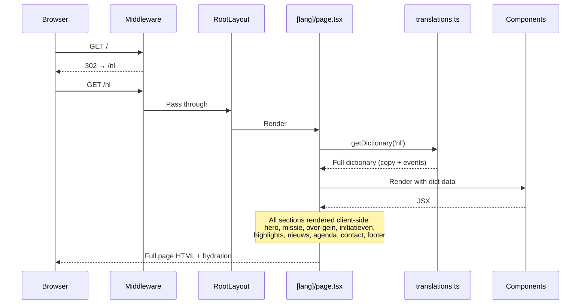
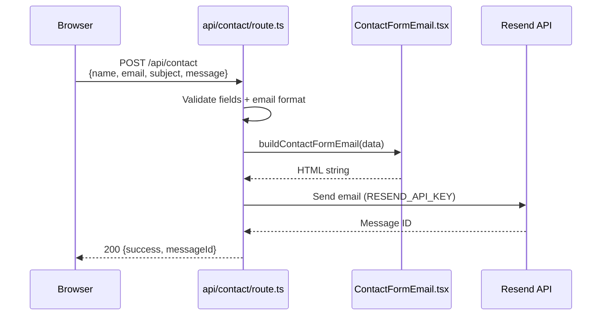

# Codebase Map

> Auto-generated by Cartographer. Last mapped: 2026-03-06

## System Overview

BPGwebsite is a **community website for Buurtplatform Gein** (a neighborhood platform in Amsterdam-Zuidoost). It's built on a Next.js 15 starter template with shadcn/ui, serving multilingual content (Dutch, English, Arabic) as a mostly static single-page site with a contact form API endpoint.

```mermaid
graph TB
    subgraph Browser
        User[User Browser]
    end
    subgraph "Next.js App (App Router)"
        MW[Middleware<br/>Locale enforcement]
        RL[Root Layout<br/>HTML shell]
        LP["[lang]/page.tsx<br/>'use client' monolith"]
        NP["nieuws/[slug]<br/>SSG article pages"]
        API["api/contact<br/>Resend email"]
        Demo["(starter-demo)<br/>Component kitchen sink"]
    end
    subgraph "Data Layer (Static)"
        Trans[translations.ts<br/>All copy + content]
        Agenda[translations/shared/agenda.ts<br/>Recurring events engine]
        News[newsItems.ts<br/>24 Dutch articles]
    end
    subgraph "Email"
        Email[ContactFormEmail.tsx<br/>HTML email template]
        Resend[Resend API]
    end
    subgraph "UI Layer"
        Comp[src/components/<br/>BPG + demo components]
        Reg[src/registry/<br/>shadcn/ui New York v4]
    end

    User --> MW
    MW --> RL
    RL --> LP
    RL --> NP
    RL --> Demo
    LP --> Trans
    LP --> Agenda
    LP --> Comp
    LP -->|POST| API
    API --> Email
    Email --> Resend
    NP --> News
    Comp --> Reg
    Demo --> Comp
```

## Tech Stack

| Technology | Version | Purpose |
|---|---|---|
| Next.js | ^15.5.7 | App Router, Turbopack dev |
| React | ^19.2.1 | UI framework |
| TypeScript | ^5.9.3 | Type safety |
| Tailwind CSS | ^4.1.16 | Utility-first styling (v4, no config file) |
| shadcn/ui | ^3.5.0 | New York v4 component system |
| Radix UI | Full suite | Accessible primitives |
| Recharts | ^3.3.0 | Data visualization |
| Resend | — | Transactional email (contact form) |
| next-themes | ^0.4.6 | Dark/light mode |
| Geist | ^1.5.1 | Font family |
| Zod | ^4.1.12 | Schema validation |
| react-hook-form | ^7.65.0 | Form management |
| Lucide React | ^0.548.0 | Icons |
| Vercel Analytics | ^1.5.0 | Usage tracking |
| Docker | Node 22 / Bun 1.2.21 | Containerized deployment |

**Dev tooling**: ESLint 9 (flat config), Prettier (120 chars, Tailwind sort plugin), EditorConfig, Node 22.19.0 (.nvmrc), DevContainers, Dependabot (weekly npm, monthly Docker)

**Deployment**: Vercel (`vercel.json` — skips dependabot builds), Docker standalone output

## Directory Structure

```
BPGwebsite/
├── src/
│   ├── app/                          # Next.js App Router
│   │   ├── layout.tsx                # Root HTML shell (lang="nl" hardcoded)
│   │   ├── globals.css               # Theme tokens, Tailwind v4 config
│   │   ├── [lang]/                   # Locale-prefixed routes
│   │   │   ├── layout.tsx            # Locale wrapper (RTL support for Arabic)
│   │   │   └── page.tsx              # MAIN PAGE — 'use client' monolith
│   │   ├── api/contact/route.ts      # Contact form API (Resend email)
│   │   ├── nieuws/[slug]/            # SSG news article pages (Dutch only)
│   │   ├── lib/translations.ts       # DEAD: stub from starter template
│   │   └── (delete-this-and-modify-page.tsx)/  # Starter demo pages
│   ├── components/                   # 68 files: BPG site + shadcn demos
│   │   ├── AgendaShowcase.tsx        # Event card grid/carousel
│   │   ├── AgendaMonthView.tsx       # Month calendar view
│   │   ├── AgendaWeekView.tsx        # Week calendar view
│   │   ├── EventModal.tsx            # Event detail overlay
│   │   ├── HighlightsShowcase.tsx    # Highlight cards + modal
│   │   ├── NewsShowcase.tsx          # News bento grid + pagination
│   │   ├── theme-provider.tsx        # next-themes wrapper
│   │   ├── app-sidebar.tsx           # Demo site sidebar
│   │   └── *-demo.tsx                # ~55 shadcn component demos
│   ├── emails/                       # Email templates
│   │   └── ContactFormEmail.tsx      # BPG-branded HTML email builder
│   ├── translations/                 # Extracted translation modules
│   │   └── shared/agenda.ts          # Recurring event generation engine
│   ├── registry/new-york-v4/        # shadcn/ui component library
│   │   ├── ui/                       # 46 primitive components
│   │   ├── charts/                   # 70 Recharts chart variants
│   │   ├── blocks/                   # 82 page template files
│   │   ├── hooks/                    # use-mobile.ts
│   │   └── lib/                      # cn() utility (duplicate)
│   ├── lib/                          # Core utilities
│   │   ├── i18n.ts                   # Locale config (nl, en, ar)
│   │   ├── getDictionary.ts          # Locale → dictionary lookup
│   │   ├── translations.ts           # ALL content: copy + agenda events + annualReport2025
│   │   └── utils.ts                  # cn() + absoluteUrl()
│   ├── data/                         # Static data
│   │   ├── newsItems.ts              # 24 Dutch news articles
│   │   └── newsTranslations.ts       # EN/AR translations (UNUSED)
│   ├── types/                        # Type definitions
│   │   ├── agenda.ts                 # AgendaEvent type
│   │   ├── content.ts                # HighlightContentBlock, HighlightItem
│   │   ├── translations.ts           # TranslationSchema (full dictionary shape)
│   │   └── news.ts                   # NewsTranslation type (UNUSED)
│   ├── hooks/
│   │   └── use-meta-color.ts         # Meta theme-color hook (UNUSED)
│   ├── middleware.ts                 # Locale prefix enforcement
│   └── __registry__/                 # Auto-generated component index
├── .vscode/                          # VSCode workspace config
│   ├── extensions.json               # 18 recommended extensions
│   ├── launch.json                   # 4 debug configurations (server, client, full-stack)
│   └── settings.json                 # Format-on-save, ESLint, Prettier
├── .devcontainer/devcontainer.json   # Docker dev container (Node 22 Bookworm)
├── .github/
│   ├── dependabot.yml                # Weekly npm, monthly Docker updates
│   └── funding.yml                   # Sponsorship links
├── components.json                   # shadcn/ui CLI config
├── Dockerfile / Dockerfile.bun       # Container configs
├── next.config.ts                    # standalone output, bundle analyzer
├── package.json                      # "nextjs-15-starter-shadcn"
├── vercel.json                       # Vercel deployment (skip dependabot builds)
├── eslint.config.mjs                 # ESLint 9 flat config
├── .prettierrc.json                  # Prettier config (120 chars, Tailwind sort)
├── .editorconfig                     # Editor formatting rules
├── .npmrc                            # legacy-peer-deps = true
├── .nvmrc                            # Node 22.19.0
├── postcss.config.mjs                # Tailwind v4 PostCSS plugin
└── tsconfig.json                     # Strict, path alias @/* → src/*
```

## Module Guide

### src/app/ — App Router Pages

**Purpose**: Next.js App Router page tree
**Entry point**: `layout.tsx` (root shell) → `[lang]/page.tsx` (main site)

| File | Purpose | Key Details |
|------|---------|-------------|
| `layout.tsx` | Root HTML shell | Hardcoded `lang="nl"`, imports `globals.css` |
| `globals.css` | Theme + Tailwind v4 | Warm orange/brown palette, CSS custom props |
| `[lang]/layout.tsx` | Locale wrapper | Sets `dir="rtl"` for Arabic; uses `Promise<params>` (Next.js 15) |
| `[lang]/page.tsx` | **Main BPG page** | ~500+ line `'use client'` monolith with all sections |
| `api/contact/route.ts` | **Contact form API** | Validates fields, sends via Resend, uses `RESEND_API_KEY` env var |
| `nieuws/[slug]/page.tsx` | News article SSG | Dutch-only, `generateStaticParams`, uses `Promise<params>` |
| `(delete-this-and-modify-page.tsx)/` | Starter demo | Component kitchen sink, should be removed |

**Key patterns**:
- `[lang]/page.tsx` uses React 19's `use()` to unwrap async params
- All page sections rendered in one client component: hero, missie, over-gein, initiatieven, highlights, nieuws, agenda, contact, footer
- `IntersectionObserver` tracks active nav section
- Scroll-based carousels with `useRef` + manual `scrollTo`
- Contact form POSTs to `/api/contact` which sends branded HTML email via Resend

### src/lib/ — Core Utilities

**Purpose**: i18n system, dictionary, and shared utilities

| File | Purpose | Key Details |
|------|---------|-------------|
| `i18n.ts` | Locale config | `['nl', 'en', 'ar']`, default `'nl'` |
| `getDictionary.ts` | Dictionary lookup | Falls back to `'nl'`; re-exports `Dictionary` type |
| `translations.ts` | **All content** | UI copy, agenda events, all 3 locales, annualReport2025 sections |
| `utils.ts` | cn() + absoluteUrl() | `absoluteUrl` references undefined `NEXT_PUBLIC_APP_URL` |

**Key patterns**:
- Recurring events engine: 4 event templates with full 2026 date arrays, expanded per locale
- `Intl.DateTimeFormat` for locale-aware date formatting (NL, EN-GB, AR-SA)
- Manual i18n: no next-intl or i18next, just static dictionaries
- Dictionary includes `annualReport2025` sections and `contact` form fields with subject options

### src/translations/ — Extracted Translation Modules

**Purpose**: Modular agenda event generation, extracted from the monolithic translations.ts

| File | Purpose | Key Details |
|------|---------|-------------|
| `shared/agenda.ts` | Recurring event engine | Exports `agendaEventsByLocale` — 4 recurring + 2 fixed events for 2026 |

### src/emails/ — Email Templates

**Purpose**: Server-side HTML email template builders

| File | Purpose | Key Details |
|------|---------|-------------|
| `ContactFormEmail.tsx` | Contact form email | `buildContactFormEmail()` returns BPG-branded HTML; escapes HTML, formats multiline |

### src/components/ — UI Components

**Purpose**: 68 files split into BPG site components, infrastructure, and shadcn demos

#### BPG Site Components (6 files)

| File | Purpose | Key Details |
|------|---------|-------------|
| `AgendaShowcase.tsx` | Event cards grid/carousel | Mobile snap-scroll, desktop 3-col grid, filters to upcoming |
| `AgendaMonthView.tsx` | Month calendar | Monday-start, current year only, click → event list |
| `AgendaWeekView.tsx` | Week calendar | 3-col grid, Sunday spans full row, Dutch word splits |
| `EventModal.tsx` | Event detail overlay | Add-to-Calendar (Google, iCal, Outlook), prev/next nav |
| `HighlightsShowcase.tsx` | Highlight cards + modal | Hand-rolled modal, hardcoded brown/orange colors |
| `NewsShowcase.tsx` | News bento grid | Mobile carousel + desktop pagination, inline article modal |

#### Infrastructure (5 files)

| File | Purpose |
|------|---------|
| `theme-provider.tsx` | next-themes `ThemeProvider` wrapper |
| `mode-switcher.tsx` | Dark/light toggle + meta-color update |
| `app-sidebar.tsx` | Demo site sidebar (uses registry blocks) |
| `component-wrapper.tsx` | Demo component section wrapper with error boundary |
| `analytics.tsx` | Vercel Analytics wrapper |

#### Demo Components (~55 files)

All `*-demo.tsx` files demonstrate individual shadcn/ui components. Used by the starter template kitchen sink at `(delete-this-and-modify-page.tsx)/examples/page.tsx`.

### src/registry/new-york-v4/ — shadcn/ui Component Library

**Purpose**: Standard shadcn/ui New York v4 registry — **unmodified from upstream**

| Subdirectory | Files | Purpose |
|---|---|---|
| `ui/` | 46 | Primitive components (Button, Card, Dialog, Sidebar, etc.) |
| `charts/` | 70 | Recharts wrappers (Area, Bar, Line, Pie, Radar, Radial, Tooltip) |
| `blocks/` | 82 | Page templates (5 login variants, 16 sidebar layouts) |
| `hooks/` | 1 | `useIsMobile()` responsive hook |
| `lib/` | 1 | `cn()` utility (duplicate of `src/lib/utils.ts`) |

### src/data/ — Static Content

| File | Purpose | Status |
|------|---------|--------|
| `newsItems.ts` | 24 Dutch news articles | Active — used by `nieuws/[slug]` and `NewsShowcase` |
| `newsTranslations.ts` | EN/AR article translations | **UNUSED** — never wired to any page |

### src/types/ — Type Definitions

| File | Purpose | Status |
|------|---------|--------|
| `agenda.ts` | `AgendaEvent` type (start/end optional) | Active |
| `content.ts` | `HighlightContentBlock`, `HighlightItem`, duplicate `AgendaEvent` | Active but has type conflict |
| `translations.ts` | `TranslationSchema` — full dictionary shape with all sections | **NEW** — complete type contract |
| `news.ts` | `NewsTranslation` type | **Likely unused** — duplicate of export in `newsItems.ts` |

### src/middleware.ts — Locale Enforcement

Redirects all routes to include a locale prefix (`/nl`, `/en`, `/ar`). Bypasses `/_next`, `/api`, `/static`, and file extensions.

## Data Flow





## Conventions

- **Styling**: Tailwind CSS v4 utility classes everywhere; no CSS modules
- **Formatting**: Prettier (120 char width, 4-space indent, single quotes, no trailing commas, Tailwind class sort)
- **Component imports**: `@/registry/new-york-v4/ui/*` for primitives, `@/components/*` for app components
- **Path alias**: `@/*` maps to `src/*`
- **Icons**: Lucide React exclusively
- **Colors**: CSS custom properties (`bg-primary`, `text-foreground`); BPG brand colors hardcoded in site components (`#43160c`, `#d06129`, `#ff4d00`)
- **Client components**: Explicitly marked with `'use client'`
- **Data**: All content is static TypeScript — no CMS, no database
- **API**: Single endpoint (`/api/contact`) for email via Resend
- **i18n**: Manual dictionary pattern with 3 locales (nl, en, ar)
- **RTL**: Arabic locale gets `dir="rtl"` via `[lang]/layout.tsx`
- **Env vars**: `RESEND_API_KEY` (required for contact form), `NEXT_PUBLIC_APP_URL` (referenced but undefined)

## Known Issues & Gotchas

### Routing Bug
`nieuws/[slug]` is **not** nested under `[lang]`. The middleware redirects `/nieuws/slug` to `/nl/nieuws/slug`, which 404s because the route only exists at `/nieuws/[slug]`.

### Rules of Hooks Violation
`EventModal.tsx` has `useMemo` calls placed **after** an early return, violating React's Rules of Hooks. This will crash in strict mode.

### Hardcoded `lang="nl"`
Root `layout.tsx` hardcodes `lang="nl"` on `<html>` even though the app supports 3 locales. Should be dynamic.

### Monolithic Client Page
`[lang]/page.tsx` is a ~500+ line `'use client'` component rendering all page sections. No code splitting, no RSC streaming, no Suspense boundaries.

### Dead Code
- `src/data/newsTranslations.ts` — EN/AR translations never consumed
- `src/types/news.ts` — duplicate type definition
- `src/hooks/use-meta-color.ts` — unused hook
- `src/app/lib/translations.ts` — stub from starter template
- `(delete-this-and-modify-page.tsx)` route group — starter template demo

### Duplicate Type Definitions
- `AgendaEvent`: defined in `src/types/agenda.ts` (optional start/end) AND `src/types/content.ts` (required start/end)
- `NewsTranslation`: defined in `src/types/news.ts` AND `src/data/newsItems.ts`
- `cn()`: defined in `src/lib/utils.ts` AND `src/registry/new-york-v4/lib/utils.ts`

### Static Content
All content (news articles, agenda events, UI copy) lives in TypeScript files. Any update requires code changes and redeployment.

### Dutch-Specific Hardcoding
- `AgendaWeekView.tsx` has Dutch word breakpoints in `splitTitleSegments()`
- `NewsShowcase.tsx` date parser only handles Dutch month names
- News article dates are informal strings (`'juli 2024'`), not ISO dates

### Undefined Environment Variable
`absoluteUrl()` in `src/lib/utils.ts` references `process.env.NEXT_PUBLIC_APP_URL` which is never defined.

### styled-jsx Usage
`AgendaShowcase.tsx` and `NewsShowcase.tsx` use `<style jsx>` which requires styled-jsx to be configured — non-standard for App Router.

## Navigation Guide

**To add a new page section**: Edit `src/app/[lang]/page.tsx` — add section JSX, update `SectionWrapper`, add nav link, add dictionary entries in `src/lib/translations.ts`

**To add a new locale**: Update `src/lib/i18n.ts` locales array, add dictionary entries to `src/lib/translations.ts`, add news translations to `src/data/newsTranslations.ts` (and wire them up)

**To add a news article**: Add entry to `src/data/newsItems.ts`, optionally add translations to `src/data/newsTranslations.ts`

**To add a new agenda event**: Add to recurring arrays or one-off events in `src/translations/shared/agenda.ts` (or `src/lib/translations.ts` for one-offs)

**To add a new API endpoint**: Create `src/app/api/<name>/route.ts` with exported HTTP method handlers

**To add a new shadcn/ui component**: Run `npx shadcn add <component>` — installs to `src/registry/new-york-v4/ui/`

**To modify the theme**: Edit CSS custom properties in `src/app/globals.css` under `:root` and `.dark`

**To configure email**: Set `RESEND_API_KEY` env var; edit `src/emails/ContactFormEmail.tsx` for template, `src/app/api/contact/route.ts` for recipient

**To fix the nieuws routing bug**: Move `src/app/nieuws/` under `src/app/[lang]/nieuws/` and update the page to accept locale params
